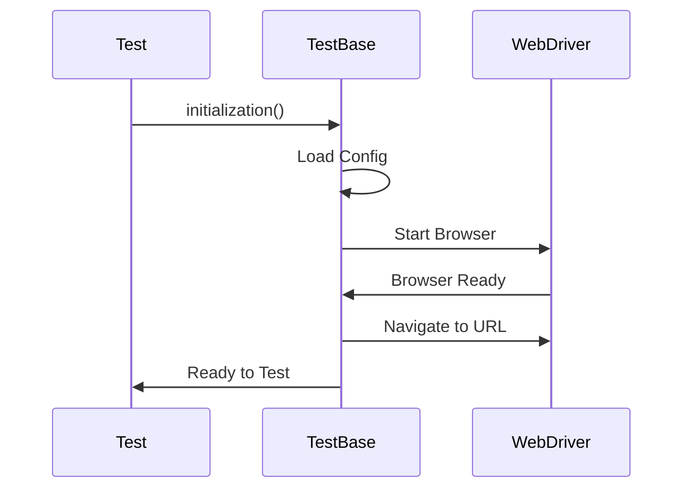

# Chapter 1: Test Base: The Foundation

# Motivation
Imagine you are building a house. Before you put up walls or a roof, you need a solid foundation. In our testing framework, the **Test Base** is that foundation. It's the parent of all our tests, ensuring that every test has a browser ready to go and knows where to find its settings.

# Core Explanation
The `TestBase` class is like a "Base Camp" for our tests. It handles the heavy lifting of initializing the WebDriver (the robot that controls the browser), loading configuration properties (like which URL to visit), and setting up logging. Every page object and test class typically interacts with or inherits from this base.

# Code Examples
<details><summary>code block</summary>

```java
public class TestBase {
    public static WebDriver driver;
    public static Properties prop;

    public TestBase() {
        // Load settings from config.properties
        prop = new Properties();
        FileInputStream ip = new FileInputStream("config.properties");
        prop.load(ip);
    }

    public static void initialization() {
        // Open the browser based on settings
        String browserName = prop.getProperty("browser");
        if(browserName.equals("chrome")) {
            driver = new ChromeDriver();
        }
        driver.get(prop.getProperty("url"));
    }
}
```
</details>

# Internal Walkthrough
When a test starts, it calls the `initialization()` method. Here is what happens:


# Cross-Linking
The Test Base sets up the [WebDriver](08_webdriver_management.md) and uses [Configuration Management](04_configuration_management.md) to know what to do.

# Conclusion
Now that we have our foundation, we can start building the parts of the house that users actually see. Next, we'll look at the [Page Object Model](02_page_object_model.md).
