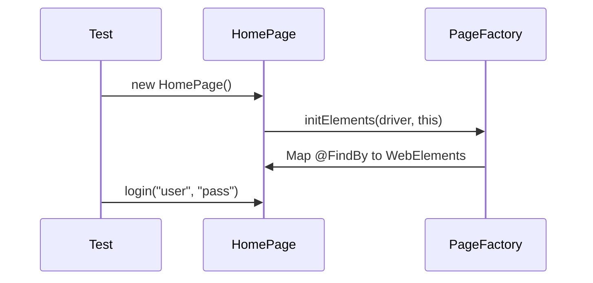

# Chapter 2: Page Object Model: Organizing the UI

# Motivation
Have you ever tried to find a specific spice in a messy kitchen cabinet? It's frustrating! The **Page Object Model (POM)** is like organizing your spices into labeled jars. Instead of having web element "ingredients" scattered all over your tests, we put them into neat classes that represent each page of the website.

# Core Explanation
In POM, each web page is a Java class. The buttons, text boxes, and links on that page are variables in the class, and the actions you can take (like logging in) are methods. This makes tests much easier to read and, more importantly, if the website's design changes, you only have to fix it in one place!

# Code Examples
<details><summary>code block</summary>

```java
public class HomePage extends TestBase {
    // Find the username box
    @FindBy(xpath = "//input[@id='username']")
    WebElement userNameTxtBox;

    public HomePage() {
        // Initialize the elements on this page
        PageFactory.initElements(driver, this);
    }

    public DashboardPage login(String un, String pwd) {
        userNameTxtBox.sendKeys(un);
        // ... more steps ...
        return new DashboardPage();
    }
}
```
</details>

# Internal Walkthrough
When you create a new Page Object, Selenium's `PageFactory` "finds" all the elements you marked with `@FindBy`.


# Cross-Linking
Page Objects inherit from the [Test Base](01_test_base.md) to get access to the driver. They often use [Test Utilities](03_test_utilities.md) to handle complex actions.

# Conclusion
With our pages organized, writing tests becomes as easy as telling a story. Next, let's see some of the tools we use to make those stories even simpler in [Test Utilities](03_test_utilities.md).
