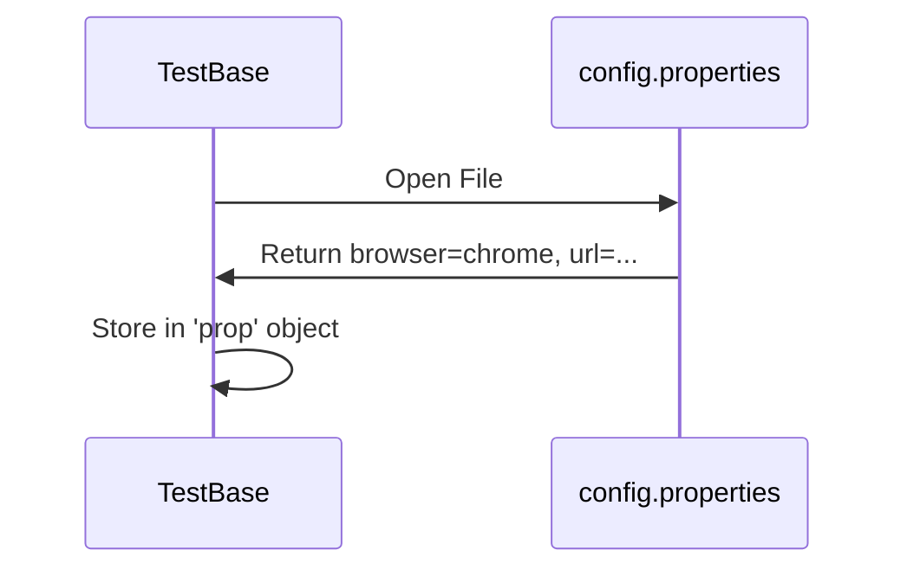

# Chapter 4: Configuration Management: Settings at Your Fingertips

# Motivation
You wouldn't want to change your code every time you wanted to test on a different browser or a different URL, right? That would be like rebuilding your car just to change the radio station! **Configuration Management** lets us change settings without touching the code.

# Core Explanation
We use `.properties` files to store our settings. These are simple text files with "key=value" pairs. Our framework reads these files when it starts up, so you can change the browser from "chrome" to "firefox" just by editing a text file.

# Code Examples
<details><summary>code block</summary>

```properties
# config.properties
browser=chrome
url=https://app.medpay.in/
username=myUser
password=myPassword
```
</details>

# Internal Walkthrough
The `TestBase` class reads this file during its construction phase.


# Cross-Linking
The [Test Base](01_test_base.md) is the main consumer of these settings, using them to decide which [WebDriver](08_webdriver_management.md) to start.

# Conclusion
By separating settings from code, we make our framework flexible. Next, let's see how we track the results of our tests in [Test Reporting](05_test_reporting.md).
