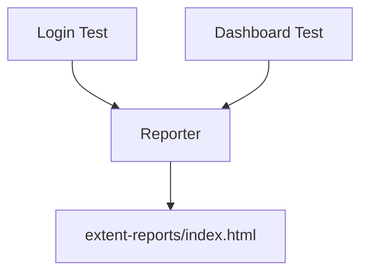

# Chapter 5: Test Reporting: Visualizing Success

# Motivation
If a hundred tests run and you only see "PASSED" or "FAILED" in a black terminal window, it's hard to know what actually happened. **Test Reporting** turns those results into a beautiful, easy-to-read website that tells the story of your test run.

# Core Explanation
We use **Extent Reports** to create HTML reports. These reports include details about which tests passed, which failed, how long they took, and even screenshots of failures. It's like a scoreboard for your automation!

# Code Examples
<details><summary>code block</summary>

```java
public class ExtentReporterNG {
    public static ExtentReports getReportObject() {
        String path = System.getProperty("user.dir") + "/extent-reports/index.html";
        ExtentSparkReporter reporter = new ExtentSparkReporter(path);
        reporter.config().setReportName("Web Automation Results");

        ExtentReports extent = new ExtentReports();
        extent.attachReporter(reporter);
        return extent;
    }
}
```
</details>

# Internal Walkthrough
As tests run, they send updates to the Reporter, which compiles them into the final HTML file.


# Cross-Linking
The reporter captures data from the [Test Execution](07_test_execution_testng.md) and can include screenshots taken by [Test Utilities](03_test_utilities.md).

# Conclusion
Good reporting makes it easy to share results with the whole team. Now, let's see how we make these tests run automatically in [GitHub Actions](06_github_actions_ci.md).
