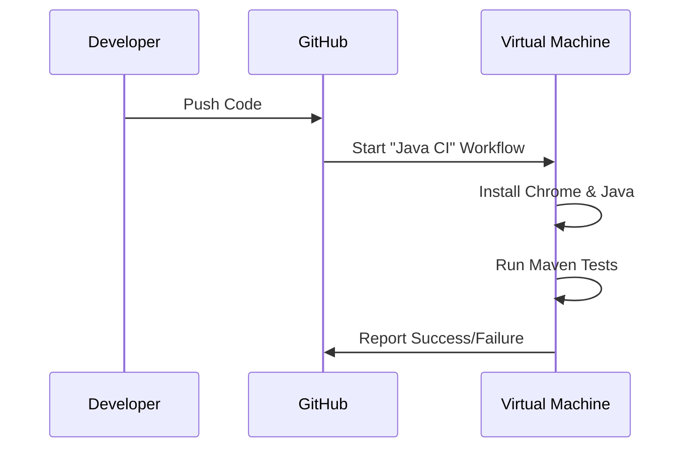

# Chapter 6: GitHub Actions: Automation on Auto-pilot

# Motivation
Imagine having a robot that runs your tests every single time you save your work and push it to the cloud. You don't have to remember to run them—they just happen! That's what **GitHub Actions** does for us.

# Core Explanation
GitHub Actions is a "Continuous Integration" (CI) tool. We define a "workflow" in a YAML file that tells GitHub: "Whenever code is pushed, start a virtual computer, install Java and Chrome, and run my Maven tests."

# Code Examples
<details><summary>code block</summary>

```yaml
# .github/workflows/maven.yml
on:
  push:
    branches: [ main ]

jobs:
  build:
    runs-on: ubuntu-latest
    steps:
    - uses: actions/checkout@v2
    - name: Set up JDK 1.8
      uses: actions/setup-java@v1
    - name: Build with Maven
      run: mvn test --file MedPay_AI_TestSuite/pom.xml
```
</details>

# Internal Walkthrough
When you push code, GitHub sees the trigger and starts the process.


# Cross-Linking
GitHub Actions runs the entire suite defined in [Test Execution](07_test_execution_testng.md).

# Conclusion
With CI, we catch bugs almost as soon as they are written! Next, let's look at how we actually group and run those tests in [Test Execution](07_test_execution_testng.md).
