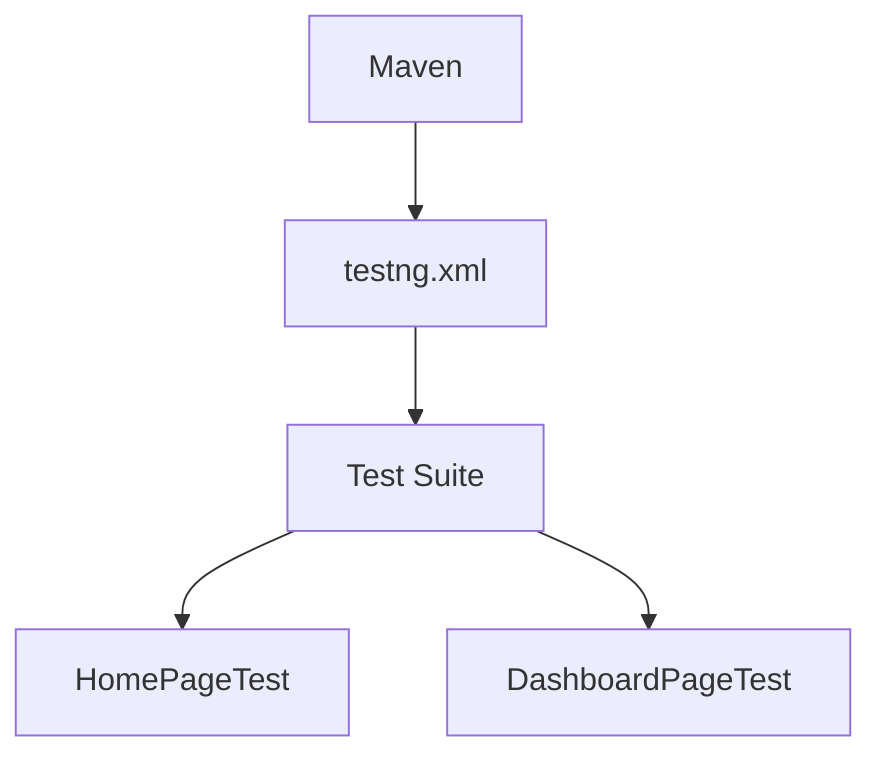

# Chapter 7: Test Execution: Orchestrating the Show

# Motivation
If you have 100 tests, you might not want to run all of them every time. Or maybe you want to run them in a specific order. **TestNG** is like the conductor of an orchestra, making sure every "instrument" (test) plays at the right time.

# Core Explanation
We use a file called `testng.xml` to organize our tests. It allows us to group tests, set which ones should run first, and even run tests in parallel to save time. It's the command center for our test runs.

# Code Examples
<details><summary>code block</summary>

```xml
<!-- testng.xml -->
<suite name="MedPay Test Suite">
    <test name="Regression Tests">
        <classes>
            <class name="com.medpay.qa.testcases.HomePageTest"/>
            <class name="com.medpay.qa.testcases.DashboardPageTest"/>
        </classes>
    </test>
</suite>
```
</details>

# Internal Walkthrough
When you run the command `mvn test`, Maven looks at `testng.xml` to find out what to do.


# Cross-Linking
TestNG is triggered by [GitHub Actions](06_github_actions_ci.md) and reports its results through [Test Reporting](05_test_reporting.md).

# Conclusion
Orchestrating our tests makes them manageable. Now let's look at the actual "engine" that moves the browser: [WebDriver Management](08_webdriver_management.md).
