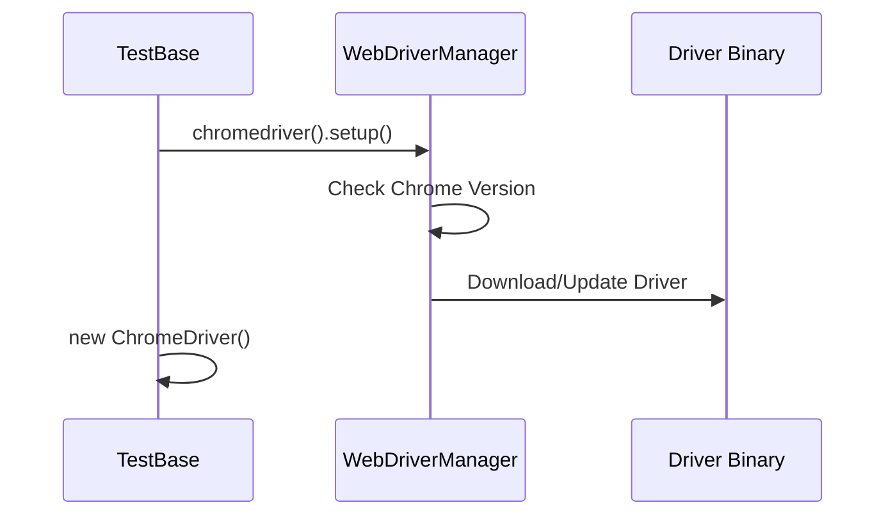

# Chapter 8: WebDriver Management: Driving the Browser

# Motivation
To test a website, you need a browser. But browsers like Chrome or Firefox need a special "driver" to take commands from a computer program. **WebDriver Management** is like the chauffeur for our tests, making sure the right car (browser) is ready for the trip.

# Core Explanation
We use **WebDriverManager** to automatically download and set up the correct driver version for your browser. This saves us from the headache of manually downloading `chromedriver.exe` every time Chrome updates.

# Code Examples
<details><summary>code block</summary>

```java
// Inside TestBase.initialization()
if (browserName.equals("chrome")) {
    // Automatically setup the driver
    WebDriverManager.chromedriver().setup();

    // Set options (like running without a visible window)
    ChromeOptions options = new ChromeOptions();
    options.addArguments("--headless");

    driver = new ChromeDriver(options);
}
```
</details>

# Internal Walkthrough
WebDriverManager checks your browser version and downloads the matching driver if you don't have it.


# Cross-Linking
The [Test Base](01_test_base.md) uses WebDriverManager during initialization.

# Conclusion
Managing the driver automatically means one less thing for us to worry about! Finally, let's see how we can "eavesdrop" on the driver's actions in [Event Listening](09_event_listening.md).
