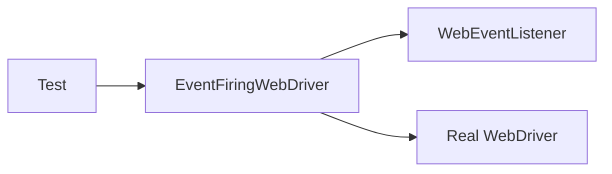

# Chapter 9: Event Listening: Watching Every Move

# Motivation
Have you ever wished you could see exactly what happened right before a test failed? An **Event Listener** is like a security camera for your tests. It "listens" for every click and every page load, and can log those actions or take action if something goes wrong.

# Core Explanation
The `WebEventListener` class implements a "listener" interface. Whenever the driver does something (like clicking a button), the listener is notified. We use this to print messages to the console so we can follow the test's progress step-by-step.

# Code Examples
<details><summary>code block</summary>

```java
public class WebEventListener implements WebDriverEventListener {
    public void beforeClickOn(WebElement element, WebDriver driver) {
        System.out.println("Trying to click on: " + element.toString());
    }

    public void afterClickOn(WebElement element, WebDriver driver) {
        System.out.println("Clicked on: " + element.toString());
    }

    public void onException(Throwable error, WebDriver driver) {
        System.out.println("Exception occurred: " + error);
    }
}
```
</details>

# Internal Walkthrough
We wrap our normal driver in an `EventFiringWebDriver` to enable this functionality.


# Cross-Linking
The [Test Base](01_test_base.md) registers the listener during initialization.

# Conclusion
Event listening gives us deep insight into our tests. You've now completed the tour of the Selenium POM Framework! Go back to the [Main Table of Contents](index.md) to review.
