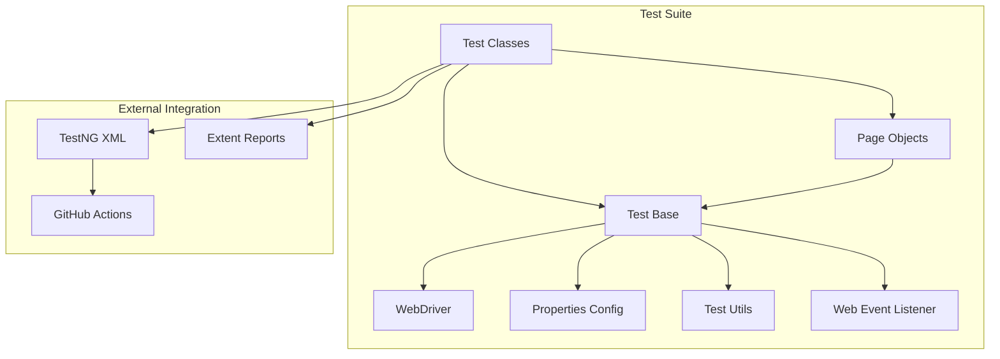

# Selenium POM Framework Documentation

Welcome to the official documentation for the Selenium POM Framework Demo. This project is a robust, scalable, and maintainable automated testing suite built with Java and Selenium, following the Page Object Model (POM) design pattern.

## Project Summary
This test suite is designed to automate web application testing with a focus on clean code and separation of concerns. By using the Page Object Model, we decouple the test logic from the UI elements, making the tests easier to maintain and read. The project integrates with GitHub Actions for Continuous Integration, providing automated feedback on every code push.

## Project Architecture
The following diagram illustrates how the core components of the framework interact with each other:

## Chapters
1. [Test Base: The Foundation](01_test_base.md)
2. [Page Object Model: Organizing the UI](02_page_object_model.md)
3. [Test Utilities: The Swiss Army Knife](03_test_utilities.md)
4. [Configuration Management: Settings at Your Fingertips](04_configuration_management.md)
5. [Test Reporting: Visualizing Success](05_test_reporting.md)
6. [GitHub Actions: Automation on Auto-pilot](06_github_actions_ci.md)
7. [Test Execution: Orchestrating the Show](07_test_execution_testng.md)
8. [WebDriver Management: Driving the Browser](08_webdriver_management.md)
9. [Event Listening: Watching Every Move](09_event_listening.md)
